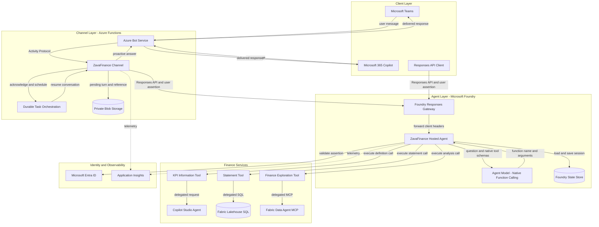
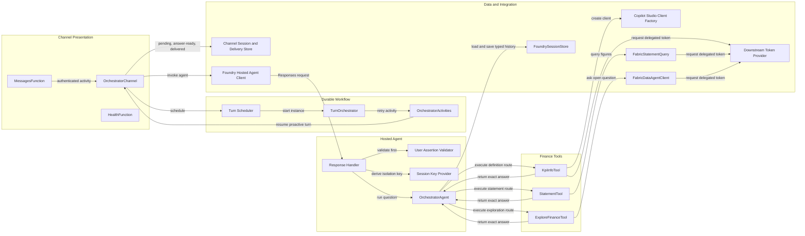

# Architecture Diagram

ZavaFinance separates channel delivery from finance-agent execution. The channel provides the Teams and Microsoft 365 Copilot entry point, while a Foundry hosted agent provides reusable routing, identity isolation, and delegated access to finance systems.

## Application Architecture

<!-- mermaid-checked: no \n, no em-dash/en-dash, no {} in labels, subgraphs are id["label"], arrows are -->|"label"|, all subgraphs closed by end, ids unique -->

### Technology Stack Summary

| Layer | Technology | Version | Purpose |
|---|---|---:|---|
| Clients | Microsoft Teams, Microsoft 365 Copilot, Responses API | Current service | User-facing and direct API entry points |
| Channel | .NET, Azure Functions isolated worker | .NET 10, Functions v4 | Bot authentication, identity acquisition, acknowledgement, scheduling, and proactive delivery |
| Channel workflow | Durable Task Scheduler | 1.25.0 client and worker | Executes slow turns outside the Bot Service response timeout with retries |
| Channel state | Azure Blob Storage | Microsoft.Agents.Storage.Blobs 1.8.77 | Stores pending turns, conversation references, and idempotency records |
| Hosted agent | Microsoft Foundry hosted agent | Azure.AI.AgentServer.Responses 1.0.0-beta.8 - Preview | Exposes the Responses API handler and runs the agent container |
| Native function calling | Microsoft Agent Framework | Microsoft.Agents.AI 1.21.0 - GA | Model selects a tool; host validates and executes it without model answer synthesis |
| Agent state | Foundry State Store | Platform managed | Stores per-user routing state and downstream conversation handles |
| Identity | Microsoft Entra ID and MSAL OBO | Microsoft.Identity.Client 4.89.0 | Validates user assertions and obtains delegated downstream tokens |
| KPI knowledge | Copilot Studio agent | Microsoft.Agents.CopilotStudio.Client 1.8.77 - GA | Returns sourced KPI definitions and calculations |
| Structured finance | Fabric lakehouse SQL analytics endpoint | Microsoft.Data.SqlClient 6.1.4 - GA | Executes parameterized KPI statement queries under user permissions |
| Exploratory finance | Fabric data agent over MCP | MCP 2025-06-18 | Answers open-ended finance questions under user permissions |
| Observability | OpenTelemetry and Azure Monitor | Microsoft.OpenTelemetry 1.0.7 | Emits channel and hosted-agent telemetry |

### Data Storage & External Services

The channel uses private Blob Storage for pending turns, proactive conversation references, and idempotency records required by Durable Task. The hosted agent keeps routing history and downstream conversation handles in the platform-managed Foundry State Store under a key derived from validated tenant, user, and conversation identity. Finance data is read from Fabric through delegated SQL or a stateless MCP data-agent call, while KPI definitions come from a stateful Copilot Studio conversation. Microsoft Entra ID supplies signing metadata and On-Behalf-Of tokens; user assertions and access tokens are not stored in orchestration state.

### Key Architectural Decisions

- The channel and hosted agent are separate hosts so the same finance agent can serve Teams, Microsoft 365 Copilot, and direct Responses API callers.
- The channel acknowledges quickly and completes work through Durable Task because downstream calls can exceed the Bot Service timeout.
- Identity is fail-closed: the hosted agent validates the forwarded assertion before deriving a per-user session key or requesting delegated tokens.
- Native function calls are executed by the host. Tool answers are returned verbatim and never fed back to the model; history records content-free result markers instead.

## Component Relationships

<!-- mermaid-checked: no \n, no em-dash/en-dash, no {} in labels, subgraphs are id["label"], arrows are -->|"label"|, all subgraphs closed by end, ids unique -->

### Component Inventory

| Component | Layer | Type | Responsibility |
|---|---|---|---|
| `MessagesFunction` | Channel presentation | HTTP-triggered Azure Function | Authenticates and validates inbound Activity Protocol requests |
| `OrchestratorChannel` | Channel presentation | Agent application | Resolves caller identity, acknowledges messages, schedules work, and sends proactive answers |
| `HealthFunction` | Channel presentation | HTTP-triggered Azure Function | Exposes channel health status |
| `DurableTaskOrchestratorTurnScheduler` | Durable workflow | Scheduler | Starts a deterministic orchestration for each pending turn |
| `TurnOrchestrator` | Durable workflow | Durable orchestrator | Runs the processing activity with bounded retries |
| `OrchestratorActivities` | Durable workflow | Durable activity | Resumes the conversation, invokes slow work, delivers once, and records completion |
| `FoundryHostedAgentClient` | Data and integration | HTTP client | Calls Foundry with workload authorization and a separate forwarded user assertion |
| `ZavaFinanceResponseHandler` | Hosted agent | Responses API handler | Reads input, validates identity, creates OBO context, and runs native function selection and host execution |
| `UserAssertionValidator` | Hosted agent | Security service | Validates assertion signature, issuer, audience, lifetime, tenant, and user claims |
| `SessionKeyProvider` | Hosted agent | Identity service | Derives the per-user, per-conversation state key |
| `OrchestratorAgent` | Hosted agent | Routing service | Uses the model to select one route, executes it, and persists routing state |
| `KpiInfoTool` | Finance tools | Tool | Retrieves KPI definitions from Copilot Studio |
| `StatementTool` | Finance tools | Tool | Resolves scope and period, then calculates structured finance statements |
| `ExploreFinanceTool` | Finance tools | Tool | Sends open-ended questions to the Fabric data agent |
| `FoundrySessionStore` | Hosted agent | Typed state store | Stores bounded routing history, KPI context and KPIpedia conversation handle |
| Channel session and delivery store | Channel | State store | Stores platform conversation IDs and turn delivery lifecycle with cached answers |
| `CopilotStudioClientFactory` | Data and integration | Client factory | Creates a delegated Copilot Studio client |
| `FabricStatementQuery` | Data and integration | SQL repository | Executes parameterized Fabric SQL and returns additive finance components |
| `FabricDataAgentClient` | Data and integration | MCP client | Discovers and calls the published Fabric data-agent tool |
| `IDownstreamTokenProvider` | Data and integration | Authentication abstraction | Supplies caller-bound delegated tokens inside the hosted agent |
