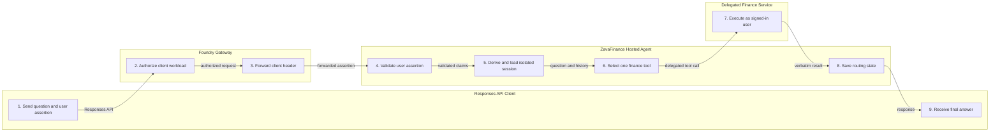

# ZavaFinance Swimlane Diagram

This swimlane shows the Teams and Microsoft 365 Copilot request path. It highlights the immediate acknowledgement, durable background processing, hosted-agent routing, delegated tool execution, and proactive delivery.

## Teams and Microsoft 365 Copilot Turn

```mermaid
flowchart LR
    subgraph SwimUser["User"]
        sUserAsk["1. Ask finance question"]
        sUserAck["7. See working message"]
        sUserAnswer["22. Receive final answer"]
    end
    subgraph SwimBot["Teams and Bot Service"]
        sBotForward["2. Forward signed activity"]
        sBotAck["6. Deliver acknowledgement"]
        sBotFinal["21. Deliver proactive message"]
    end
    subgraph SwimChannel["ZavaFinance Channel"]
        sAuth["3. Validate Bot Service JWT"]
        sIdentity["4. Resolve signed-in user"]
        sPending["5. Save pending turn"]
        sSchedule["8. Schedule durable turn"]
        sResume["10. Resume conversation"]
        sCallAgent["11. Call Foundry Responses API"]
        sCache["19. Cache answer and mark complete"]
        sSend["20. Send proactive answer"]
    end
    subgraph SwimDurable["Durable Task"]
        sStart["9. Start retryable activity"]
        sComplete["23. Complete orchestration"]
    end
    subgraph SwimFoundry["Foundry Hosted Agent"]
        sGateway["12. Authorize channel workload"]
        sValidate["13. Validate user assertion"]
        sLoad["14. Load isolated session"]
        sRoute["15. Select one finance tool"]
        sPersist["18. Persist routing state"]
    end
    subgraph SwimFinance["Delegated Finance Service"]
        sObo["16. Exchange token on behalf of user"]
        sTool["17. Query selected finance service"]
    end

    sUserAsk -->|"message"| sBotForward
    sBotForward -->|"activity"| sAuth
    sAuth -->|"trusted caller"| sIdentity
    sIdentity -->|"derived session key"| sPending
    sPending -->|"acknowledge first"| sBotAck
    sBotAck -->|"neutral progress"| sUserAck
    sPending -->|"turn reference"| sSchedule
    sSchedule -->|"instance request"| sStart
    sStart -->|"activity callback"| sResume
    sResume -->|"question and user assertion"| sCallAgent
    sCallAgent -->|"managed identity authorization"| sGateway
    sGateway -->|"forward client header"| sValidate
    sValidate -->|"trusted tenant and user"| sLoad
    sLoad -->|"question and history"| sRoute
    sRoute -->|"selected route"| sObo
    sObo -->|"delegated access token"| sTool
    sTool -->|"verbatim result"| sPersist
    sPersist -->|"response body"| sCache
    sCache -->|"idempotent delivery"| sSend
    sSend -->|"proactive activity"| sBotFinal
    sBotFinal -->|"final response"| sUserAnswer
    sCache -->|"success marker"| sComplete
```

<!-- mermaid-checked: no \n, no em-dash/en-dash, no {} in labels, subgraphs are id["label"], arrows are -->|"label"|, all subgraphs closed by end, ids unique -->

## Direct Responses API Turn

Direct clients bypass the channel and Durable Task. They call the same Foundry hosted agent, which still validates the forwarded user assertion, derives isolated state, routes one tool, and uses delegated downstream access.

<!-- mermaid-checked: no \n, no em-dash/en-dash, no {} in labels, subgraphs are id["label"], arrows are -->|"label"|, all subgraphs closed by end, ids unique -->

