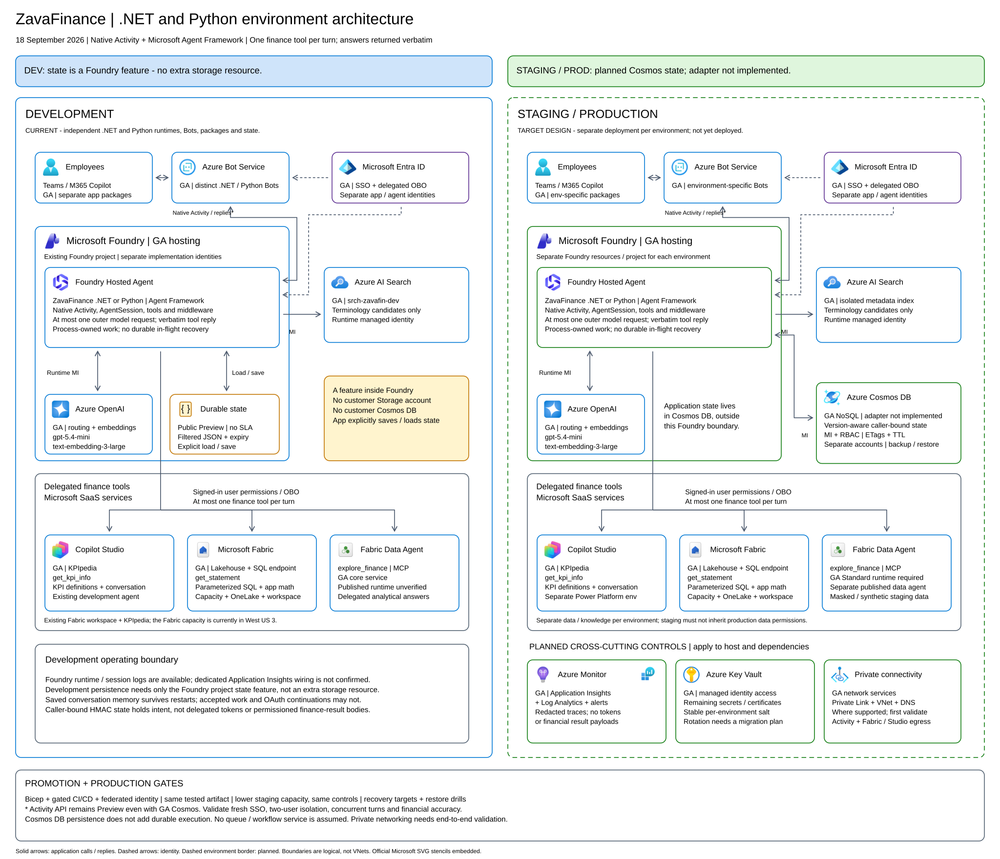
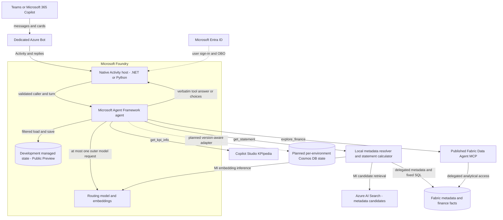
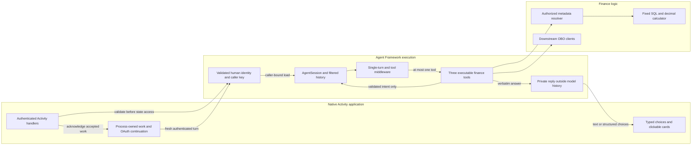

# ZavaFinance architecture

The .NET and Python implementations share this design. Each is a Foundry native
Activity application with its own Bot, app package, runtime identity and state.
Implementation details and SDK pins belong in the [.NET](../src/dotnet/README.md)
and [Python](../src/python/README.md) guides.

## Environment architecture

- [Editable Excalidraw](zavafinance-architecture.excalidraw) — open in the VS Code Excalidraw viewer.
- [SVG diagram](zavafinance-architecture.svg) — language-neutral development and planned environments.

| Boundary | Development | Staging | Production |
| --- | --- | --- | --- |
| Hosting | Existing Foundry project; independently deployed .NET/Python services | Planned independent Foundry environment | Planned independent Foundry environment |
| Finance conversation state | Foundry-managed durable state inside the project; **Public Preview, no SLA** | Planned dedicated **GA Cosmos DB for NoSQL** account | Planned dedicated **GA Cosmos DB for NoSQL** account |
| State implementation | Explicit load/save of filtered, caller-bound JSON | Version-aware adapter **not implemented** | Version-aware adapter **not implemented** |
| Identity | Distinct Bots and state salts per implementation; approved OAuth-client reuse | Isolated app/Bot identities, secrets and permissions | Isolated app/Bot identities, secrets and permissions |
| Finance data | Authorized demonstration data | Masked/synthetic data and environment-specific integrations | Approved production data and integrations |
| Operations | Foundry runtime/session logs; verify actual telemetry wiring | Planned Application Insights, Log Analytics, Key Vault and private connectivity | Planned Application Insights, Log Analytics, Key Vault and private connectivity |

Development needs no extra Storage or Cosmos resource for application state.
The planned Cosmos adapter must retain schema-version checks, caller binding,
allowlisted fields, expiry and safe reset semantics; add managed identity, Cosmos
data-plane RBAC, ETag concurrency, TTL, backup and tested restore. Staging and
production are **not deployed**. Using GA Cosmos does not make the Preview Activity
API GA or provide durable execution.

## Application Architecture

### Technology Stack Summary

This is a **service/feature** inventory, not a package support matrix.

| Layer | Technology | Availability | Purpose |
| --- | --- | --- | --- |
| Chat | Teams/M365 Copilot and Azure Bot Service | GA services | Employee conversation, sign-in and message delivery |
| Compute | Foundry Hosted Agents | **GA service** | Run native Activity handlers and the finance agent together |
| Activity ingress | Foundry Activity publishing API | **Preview API** | Protected native Activity endpoint |
| Agent execution | Microsoft Agent Framework | GA framework; exact packages in language guides | Executable tools, `AgentSession`, filtered history and middleware |
| Inference | Azure OpenAI deployments | GA selected models | GPT-5.4-mini routing; text-embedding-3-large terminology embeddings |
| Discovery | Azure AI Search | GA service | Hybrid/semantic retrieval over a versioned metadata projection |
| Business systems | Fabric SQL/lakehouse and Copilot Studio | GA core services | Finance facts, authoritative metadata and KPI definitions |
| Analysis | Fabric Data Agent Standard runtime | **GA; deployed runtime unverified** | Published delegated MCP analysis |
| Development memory | Foundry-managed durable state | **Public Preview; no SLA** | Persist filtered conversation/clarification state |
| Planned memory | Cosmos DB for NoSQL | **GA service; adapter not implemented** | Independent staging/production state stores |

### Data Storage & External Services

Fabric owns finance facts, the terminology catalogue, authorized scope membership
and active catalogue release. Search is a rebuildable metadata projection, not an
authorization authority. Candidate visibility is revalidated through delegated
Fabric access before disclosure or constrained reranking.

Only filtered conversation history, validated intent, continuation metadata and
allowed conversation identifiers may be persisted. Caller-bound HMAC keys isolate
state. Delegated tokens and permissioned tool-result bodies are excluded. This
does not eliminate business content from user prompts or the Teams/M365 transcript.

### Key Architectural Decisions

1. The framework invokes real executable tools. Middleware allows **at most one
   outer routing-model call and at most one selected finance tool**. Tool text
   reaches the user verbatim, without final model synthesis. Resolver embedding
   or constrained reranking work is inside the selected tool, not another outer
   agent turn.
2. `get_statement` uses reviewed parameterized SQL and application-owned
   `decimal`/`Decimal` calculations. Ambiguous, fuzzy or incomplete requests
   produce typed or clickable clarification rather than a guessed statement.
3. Native queues and OAuth continuation are process-owned. Persisted finance
   memory does not resume an interrupted request, and no exactly-once delivery
   or durable in-flight recovery guarantee is claimed.

## Component Relationships

### Component Inventory

| Component | Responsibility |
| --- | --- |
| Native Activity host | Protected ingress, protocol acknowledgement and reply delivery |
| Authentication boundary | Validate user assertion signature/issuer/tenant/audience/lifetime and match the Activity caller |
| Agent and middleware | Framework execution, typed argument validation, bounded model/tool selection and no synthesis |
| Session/history provider | Load/save whitelisted state, preserve safe follow-up intent, reject incompatible or foreign state |
| Finance tools | KPIpedia, deterministic statements and Fabric MCP analysis under delegated authorization |
| Resolver and calculator | Authorized catalogue binding, distinct fact scopes, period resolution, fixed queries and decimal math |
| Card renderer | Application-authored options bound to caller/request/release; no model-authored card execution |

The [swimlane](swimlane-diagram.md) details messages, OAuth, clarifications and failure
boundaries. The [administration guide](it-admin-catalogue.md) defines promotion gates.

## Diagram sources and icon terms

The editable and SVG diagrams embed 15 official Microsoft vector assets with their
aspect ratios intact. The JSON-state document symbol is application-drawn and is
not an Azure resource stencil. Logical borders are not deployed network boundaries.

- [Azure Architecture Center icons](https://learn.microsoft.com/azure/architecture/icons/)
- [Microsoft Entra icons](https://learn.microsoft.com/entra/architecture/architecture-icons)
- [Power Platform and Copilot Studio icons](https://learn.microsoft.com/power-platform/guidance/icons)
- [Fabric icons](https://learn.microsoft.com/fabric/fundamentals/icons)
- [Foundry durable state and preview limitations](https://learn.microsoft.com/azure/foundry/agents/concepts/agent-state-store)

Use these icons in accordance with their linked terms; no Microsoft endorsement is implied.
