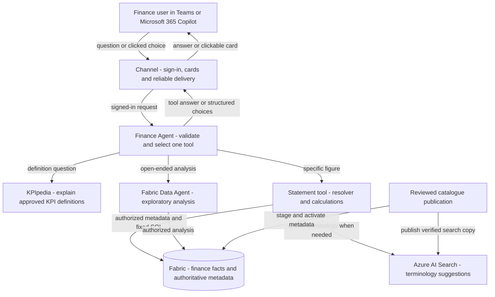

# ZavaFinance: architecture for finance and controller owners

**Audience:** finance analysts and controllers who will own the product and its code, use
GitHub Copilot or Claude for development, and prefer Python over C#.
**Baseline:** original two-host solution and acceptance evidence from 16 September 2026,
with the separate `activity-protocol` experiment clarified on 17 September.

This guide explains what you are taking over, where financial decisions belong, and which
controls the application must preserve. The Python code will be provided separately.
For the purpose of every platform component, read
[Azure and Microsoft services explained for controllers](azure-services-for-controllers.md).
Give the companion [IT-admin catalogue](it-admin-catalogue.md) to your platform team.

### Which version are you taking over?

| Area | Original Zava Finance | Zava Finance One (`activity-protocol`) |
| --- | --- | --- |
| Where channel logic runs | Separate Azure Functions Channel | Inside the Foundry-hosted agent, using native Activity handlers |
| Slow requests | Durable Task workflow and saved delivery records | In-memory background queue; interrupted work must be retried |
| Conversation memory | Foundry state store | Separate Foundry state store; memory does not recover interrupted tasks |
| Routing model | GPT-4.1-mini (**Legacy**) | GPT-5.4-mini (**GA**) |
| Hosting integration | Responses/Core beta libraries | Additional explicitly approved, unreleased source-built Activity adapter |
| Evidence | Original dated finance/card checks below | Installed; interactive login and cached-token reset work; initial SSO and full finance/card acceptance remain open |

**The detailed Channel, scheduler and delivery-cache descriptions below are the original
baseline, not services that One also needs.** One retains the same finance tools,
calculations, resolver and user-permission controls. Channel UX ownership moves to the
native Activity application; finance ownership does not change. See the
[One implementation guide](../src/ZavaFinance.One/README.md) and
[One architecture](../.github/modernize/assessment/engines/facts/architecture-diagram.md#zava-finance-one-application-architecture).
This experiment is not a Python rewrite and has **no durable task execution or crash recovery**.

## 1. The two-minute picture

Think of ZavaFinance as a controlled interface to your finance systems, not a spreadsheet
replaced by a chatbot:

- **AI interprets a request and selects a tool.** For statements, it passes the user's terms
  through without inventing a KPI, reporting unit or period.
- **A terminology resolver identifies what the user means.** If "margin" or "IT" could mean
  several things, the user chooses from a card instead of the system guessing.
- **Reviewed code calculates statement figures from authorized data.** The model does not
  write the statement SQL, invent missing values, or rewrite the calculated answer.
- **Finance owns business meaning and acceptance.** IT supplies the approved environment,
  identity setup, connectivity and operational support. Owning code does not require owning
  the Azure subscription or granting yourself access to every financial unit.

### What ownership means

| Area | Finance/controller responsibility | Platform partner responsibility |
|---|---|---|
| Finance Agent | Own routing behavior, terminology, formulas, code review and tests | Support the approved hosting, identities and integrations |
| Channel | Own the sign-in and clarification experience, delivery behavior and tests | Support messaging registration, hosting and deployment |
| Catalogue and finance data | Approve vocabulary, scope coverage and source reconciliation | Operate approved data/publication processes and enforce access |
| Releases | Approve functional behavior and financial results | Operate deployment, diagnostics and recovery within policy |

The recorded running demo uses C#/.NET. The separate Python code delivery is not assumed to be
already present in this repository. This guide focuses on responsibilities and controls rather
than a language-specific implementation plan.

GitHub Copilot and Claude are **development assistants** here. They are not automatically
part of the deployed finance application's runtime, nor authorized destinations for customer
data. Using either to write Python does not change the application's model or cloud provider.

## 2. Architecture in finance language

<!-- mermaid-checked: no \n, no em-dash/en-dash, no {} in labels, subgraphs are id["label"], arrows are -->|"label"|, all subgraphs closed by end, ids unique -->


This diagram is the **original two-host deployment**. In One the Bot reaches the
native Foundry Activity host directly; there is no separate Channel-to-Agent HTTP hop.

### Understand the services, not just their names

The [service-by-service guide](azure-services-for-controllers.md) explains each component's
purpose, data handled, failure impact and ownership. It distinguishes Functions from its
App Service plan, the hosted Agent from its models, Search from Fabric, scheduling from
application storage, and Application Insights from Log Analytics. It also covers identity,
private networking, DNS and the conditional/optional deployment services.

Microsoft Agent Framework is a programming library, MCP is a connector protocol, and Adaptive
Cards is a presentation format. They are not three more Azure services to provision.

The Channel has a delivery store; the Agent has a separate conversation/state store. Neither
replaces the finance database. Search stores catalogue descriptions and identifiers, not financial
facts. Those descriptions can still be confidential.

Three deliberate design choices:

1. Keep chat delivery separate from finance execution, so other approved clients can reuse the
   same Agent through its API.
2. Keep the resolver **inside the Agent** as a class/module, not another hosted Function.
3. Separate the dependable statement path from AI-generated explanations and exploration.

The [technical architecture](../.github/modernize/assessment/engines/facts/architecture-diagram.md)
and [swimlane](../.github/modernize/assessment/engines/facts/swimlane-diagram.md) show the lower-level
components and message sequence.

## 3. Follow a finance question through the system

| User intent | Tool | How to assess its answer |
|---|---|---|
| "What does gross margin mean?" | `get_kpi_info` | Review the sourced KPIpedia definition and its agreement with the calculator |
| "What was gross margin for EMEA in November 2025?" | `get_statement` | Reconcile the specified KPI, scope, period, value and formula to approved source data |
| "Why did margin fall across regions?" | `explore_finance` | Treat the narrative as analysis to review; check arithmetic and evidence independently |

The outer Agent selects at most one tool per turn and returns that tool's answer without a
second model rewriting it. KPIpedia and the Fabric Data Agent can themselves use AI; the entire
solution is **not** an LLM-free calculation engine.

### Worked example: "What was margin for EMEA in November 2025?"

1. The Channel establishes the user identity and hands the question to the Agent.
2. The Agent selects `get_statement`, retaining "margin", "EMEA" and "November 2025".
3. The resolver reads the active catalogue through that user's Fabric permissions.
   "Margin" is an exact alias for three KPIs, not one. This case does not need vector search.
4. The Agent returns numbered, structured options. The Channel renders three clickable rows:
   EBITDA Margin, Gross Margin and Operating Margin, with descriptive context.
5. The user clicks **Gross Margin**. There are no radio buttons or separate Continue action.
   Replying with its number also works. The server checks that the choice still belongs to this
   user, conversation, pending request and catalogue release.
6. Code queries the authorized EMEA scope and calculates gross profit divided by net revenue.
   For the synthetic demo, the answer is **42.52%**, prior **43.21%**, **0.69 percentage points down**.

For "operating expenses for IT", the same process distinguishes regional IT from Global IT.
Clicking a hierarchy description is also a row selection. If both KPI and organization need
clarification, the system can ask in successive turns; one choice does not approve every scope.

Missing or unsupported dates prompt a follow-up rather than a guessed period. An expired card,
reset conversation or changed release requires a fresh request. Previously sent cards retain
their saved layout; only new clarifications use the current renderer.

## 4. The controls finance must own

| Control | Why it matters | Current rule |
|---|---|---|
| KPI identity | Similar names can describe different measures | Only supported, authorized KPI IDs can execute; a highest search score is not approval |
| Organization identity | "IT" is not automatically the whole company's IT | Show the full reporting path and preserve regional/global qualifiers |
| Rollup scope | Global and regional views can contain the same facts | Expand to distinct region/department pairs; count each fact once |
| Ratios | Averaging departmental percentages gives the wrong total | Recompute from summed components; gross margin uses **net**, not gross, revenue |
| Headcount | Three monthly snapshots are not three times the workforce | Use closing-month FTE for a multi-month period |
| DSO | Small months must not receive the same weight as large ones | Use revenue-weighted monthly DSO; this demo has no receivables-based DSO calculation |
| Period comparison | Percentage change and percentage-point movement differ | Percentage KPIs use pp; ordinary sequential comparisons use an equal-length prior period; the YoY measure uses prior-year data |
| Missing data | Zero is a financial statement, not an error placeholder | Missing data or a zero denominator is unavailable, not invented zero |
| Calendar | "Latest" data is not necessarily a closed month | Current conventions use a January fiscal year; YTD includes the current month, not an inferred closed month; future synthetic rows do not establish close status |
| Currency and consolidation | A reporting tree is not a statutory consolidation system | The demo uses USD; it does not add FX translation, intercompany elimination or legal-ownership accounting |

The hierarchy is **Company > Region > Department group > Department**, with additional global
group/department scopes. KPI families such as Profitability are navigation, not executable
totals. Do not sum every node in a tree or sum all KPIs in a family.

The demo contains 18 executable KPIs, 114 catalogue entities and 336 scope mappings.
These are the current dataset's checks, not mandatory sizes for your company. All reference
figures here are synthetic Zava examples, not customer forecasts or accounting sign-off.

### Where business truth belongs

- **Fabric facts and dimensions:** amounts, periods and reporting keys. Customer ERP ingestion,
  reconciliation and close procedures require their own agreed data process.
- **Fabric resolver metadata:** names, aliases, hierarchy paths, permitted scope mappings and
  the active release. Search is a derived copy of this metadata.
- **Reviewed calculator code:** executable aggregation and formula rules.
- **KPIpedia:** sourced explanations of those same definitions.

A formula change must reconcile all four relevant surfaces and tests. Editing a description
or prompt alone cannot implement a new financial measure.

## 5. Identity without Azure jargon

There are two badges in play:

- **Application badge (managed identity):** allows services to call one another and the Agent
  to read Search/use the embedding model without a stored service password for those hops.
- **Employee badge (delegated access):** allows Fabric and KPIpedia requests to run as the
  signed-in person. An on-behalf-of exchange obtains the appropriate downstream token.

The Agent validates the employee badge itself. A username typed in a question or an identifier
on a card is not authentication. Runtime identity and privileged metadata-publisher identity
are separate; the runtime should not be able to publish a new catalogue.

**Search does not inherit Fabric's per-user security.** Code rechecks candidate visibility in
Fabric before exposing names/paths or sending candidate descriptions to a model, and checks
the selected scope again before querying. Fact-level row restrictions alone do not establish
who may see organizational metadata. Finance defines the visibility policy; IT/data owners
implement it and jointly prove it with different real users.

Routing history avoids storing financial tool answers and access tokens, but this is not a
promise that no business content reaches an AI service. Questions, permitted terminology and
exploratory requests flow to the configured services. Cached Channel replies and chat history
can contain finance data. Apply approved retention, residency and development-tool policies.

## 6. The code responsibilities finance owns

Service hosting does not implement the finance rules for you. These responsibilities remain
in the application, whatever language its code uses:

| Responsibility | What finance approves | Control to preserve |
|---|---|---|
| Tool selection | Which question belongs to definitions, a statement or exploration | Validate the model's call; no arbitrary tools or model-written statement SQL |
| Terminology resolver | Aliases, hierarchy paths and when users must choose | Permission checks before disclosure; no automatic semantic winner |
| Calculator | Components, formulas, units, precision and rounding | Decimal financial arithmetic; explicit unavailable-data behavior |
| Period handling | Reporting calendar and comparison rules | Explicit date boundaries; no guessed close status |
| Data adapters | Which source each tool uses | Fixed SQL parameters and signed-in-user access |
| Reply contract | Which structured options and answers are returned | Bound request/option/release identifiers, not just display labels |
| Channel | Clickable clarification rows, numeric replies and reliable delivery | No model-authored card JSON or execution from an unvalidated selection |
| State and diagnostics | Retention, isolation and useful operational evidence | Separate users/conversations; no logged credentials |
| Catalogue publication | Reviewed definitions and scope coverage | Verify a versioned Search copy before activating the Fabric release |

The [technical architecture](../.github/modernize/assessment/engines/facts/architecture-diagram.md)
maps the current implementation components. The
[reply protocol](../src/ZavaFinance.Agent/Contracts/FinanceReplyProtocol.cs) records the
language-neutral `zava-finance.v1` boundary between Agent and Channel.

The original Channel saves an answer before sending it, requires a nonempty delivery
acknowledgement, then records Delivered. Retrying a cached reply must not rerun financial work.
A crash between sending and recording delivery can still duplicate a message: this is
**at-least-once**, not exactly-once. A safe original-Channel change preserves these controls.
One still requires a nonempty reply acknowledgement, but has no persisted
AnswerReady/Delivered records or crash-safe replay; do not transfer the original
reliability claim to One.

**Microsoft Foundry Hosted Agents is GA.** The selected hosting libraries remain **prerelease**;
feature/API status and model lifecycle must be reviewed separately. For example, the routing
model `gpt-4.1-mini` is now **Legacy**, with published retirement on **14 April 2027** for
version `2025-04-14`. Use the dated [availability and support register](availability-and-support.md)
for Fabric feature status, exact exceptions and official sources. Review production approval
with IT; a documentation correction is not a dependency upgrade or deployment.

## 7. How to make an ordinary business change

| Change | Finance/code work | Release implications |
|---|---|---|
| Add an alias | Update curated metadata; test exact matches and intentional ambiguity | Publish a new immutable catalogue and verified Search index |
| Add or change a reporting branch | Review distinct fact-key coverage and metadata visibility | Reconcile totals, publish a new catalogue, verify with permitted/restricted users |
| Add a KPI or change its formula | Update reviewed calculator, supported KPI mapping, source metadata, KPIpedia and tests | Code and data release; the generator deliberately rejects an unreviewed KPI-set change |
| Load new monthly facts | Use the agreed data-ingestion/reconciliation process | Not a terminology reindex solely because amounts changed; new dimensions/scopes may require metadata publication |
| Change a card label/layout | Change the shared Activity card renderer and its tests | Deploy the selected host: original Channel or One; keep bound identifiers and the finance contract intact |
| Change model, identity, network or hosting | Joint technical review with IT/security | Not a business-only prompt edit; requires regression and deployment approval |

For catalogue changes: **stage in Fabric -> verify SQL visibility and scope totals -> publish
and probe Search -> activate the release**. The release binds four values together:
catalogue version, Search index, embedding deployment and embedding dimensions. An old card
must not execute against a changed binding.

There is no query-time catalogue indexing or automatic changed-row synchronization. Repeating
the Fabric stage with identical version/content is a no-op; changing that version's content
is rejected. The current Search publication script re-embeds the full selected catalogue on
a rerun, not only changed rows. Keep previous compatible releases for a reviewed rollback.
Use the [publication runbook](resolver-data.md); do not edit the live Search index as the source
of truth.

## 8. Working with GitHub Copilot and Claude

Treat a coding assistant as a capable contributor, not the approver of financial semantics:

1. Start from a small issue: business intent, affected KPI/scope, expected result and exclusions.
2. Ask it to inspect the supplied code and tests before editing. Require it to identify the
   affected business rule and service connection rather than inventing a new architecture.
3. Give it synthetic/minimized fixtures and require tests for wrong scope and failure cases,
   not just a successful example. Never paste credentials, access tokens or unapproved finance
   extracts into a coding assistant.
4. Review the diff, formula, SQL parameters, permission checks and test output yourself.
   A second assistant can review, but is not independent financial sign-off.
5. Use a branch and peer-reviewed pull request. Release through the approved environment
   workflow; code acceptance, cloud permissions and production deployment are distinct approvals.

Example development request:

> Add the alias "technology operations" to the existing IT catalogue metadata. Preserve all
> regional and global candidates; do not make Global IT the default. First inspect the Python
> generator and its tests. Add an ambiguity regression test, make the smallest change and show
> the diff and test result. Do not publish data, deploy, change permissions, commit or push.

Example calculation-test request:

> Add regression tests for gross-margin arithmetic in the supplied code. Read the calculator
> and existing reference tests first. Cover ratio-of-sums, missing-data, zero-denominator and
> rounding behavior. Do not add SQL generation, model calls or cloud dependencies. Report
> discrepancies; do not change expected figures to make tests pass.

Your first offline exercise can use the existing
[catalogue tests](../tools/test_resolver_catalog.py), which require Python's standard library,
not an Azure connection. From the repository root in PowerShell, with your Python environment
selected:

```powershell
python -B -m unittest discover -s .\tools -p test_resolver_catalog.py -v
```

This tests catalogue generation only, not the hosted Agent or the complete application.
Use the tests accompanying the separately supplied code for its implementation-specific checks.

## 9. Acceptance is a finance responsibility

Keep a small reference pack containing the question, permitted user, canonical KPI/scope,
period, source snapshot, expected calculation and tolerance. Capture unrounded source values
as well as displayed output. Reject a polished answer for the wrong unit or period.

| Acceptance case | What must be proved |
|---|---|
| EMEA November 2025 net revenue | Demo reference **85,639,562.37 USD**, displayed **85.6 M USD** |
| "Margin" clarification | Multiple choices; Gross Margin gives **42.52%**, prior **43.21%**, **0.69 pp down** |
| "IT" clarification | Distinct regional/global paths; Global IT November OPEX **13,098,583.70 USD**, displayed **13.1 M USD** |
| Multi-month headcount | Closing-month result, not a sum; EMEA Q4 2025 reference **3,247 FTE** |
| Wrong/changed choice | Expired, reset, forged, cross-user and changed-release selections cannot execute |
| Permission boundary | At least two real users with different rights; no unauthorized labels, facts or session reuse |
| Delivery | Clickable rows, numeric replies, restart/retry behavior and reload persistence |
| Exploration | Check the Data Agent's arithmetic, denominators, citations and reasoning separately |

Earlier live testing found exploratory narrative arithmetic errors even when the deterministic
statement path was correct. Existing single-user demo acceptance is not two-user authorization
proof or production certification. Review the [handover](../HANDOVER.md) for evidence and gaps,
[finance tests](../tests/ZavaFinance.Tests/Finance) for reference/calculation checks, and
[Channel tests](../tests/ZavaFinance.Tests/ChannelClarificationTests.cs) for interaction contracts.

## 10. Ownership, operations and handover

Finance owns the whole product and repository, including its backlog and release acceptance.
The following split identifies specialist responsibilities, not a transfer of product ownership:

| Responsibility | Finance/controller code owners | IT, security and data-platform partners |
|---|---|---|
| Business definitions, examples and reporting scopes | Accountable; implement and approve rules | Advise on source models and enforce agreed visibility |
| Agent, resolver and tests | Own code quality, review and functional acceptance | Review identity/network adapters and deployment integration |
| KPIpedia and exploratory behavior | Curate definitions; evaluate business answers | Manage approved connections, permissions and service policies |
| Data refresh and catalogue release | Reconcile results and approve business content | Operate approved publication identity, pipelines and recovery |
| Azure/Fabric environment and Entra consent | Specify availability, users and information classification | Provision, secure, monitor and administer with least privilege |
| Release and incident response | Reproduce defects, assess financial impact and authorize business readiness | Diagnose platform faults, apply approved deployments and rollbacks |
| Budget and service levels | Own spending/availability decisions | Provide meters, alerts, capacity schedules and technical estimates |

### A short troubleshooting guide

| Symptom | First check / owner |
|---|---|
| Wrong figure with the right scope | Finance: reconcile components, formula, period, currency and source snapshot |
| Missing or ambiguous KPI/unit | Finance: inspect authorized catalogue, aliases and active release; do not force the top search result |
| User sees too much or too little | Finance + security/data owner: compare intended permissions with both metadata and fact visibility |
| Fabric queries fail for everyone | Operator: check capacity state, service health and connectivity before changing code |
| Answer exists but is not delivered | Channel operator: inspect acknowledgement, AnswerReady/Delivered state and retry traces |
| Only exploratory explanation is wrong | Finance: validate the Data Agent separately; do not patch a correct statement calculator to compensate |

Live exercises require **active Fabric capacity**; offline fixtures do not. Demo capacity may
be intentionally paused between sessions. Ask the assigned operator to resume it before a
demo, and agree a pause schedule. Pausing Fabric does not stop billing for the separate Search,
Channel, model or other services; IT should provide the full cost view.

Before accepting ownership, obtain:

- Repository access, a nominated peer reviewer and approved Copilot/Claude usage policies.
- The reference pack, unresolved acceptance gaps and a named finance sign-off owner.
- The separately supplied Python code, its setup instructions, test pack and a named
  application support contact.
- A non-secret environment sheet: service purpose, endpoint, owner, support contact and
  location of securely managed configuration; never credentials in the repository.
- An approved release/rollback process, diagnostics access, operating hours and cost alerts.
- IT approval of identity, data visibility, regional policies, remaining **Preview/prerelease**
  exceptions and model-lifecycle decisions in the [support register](availability-and-support.md).

Only the demo environment is recorded as deployed. Dev/staging/prod templates are not proof
that staging and production exist. Agree separation and release gates before production use.
Infrastructure provisioning, customer policy review and service setup belong in the
[IT-admin catalogue](it-admin-catalogue.md) and [deployment runbook](deployment.md), not in an
assistant's improvised terminal commands.

**Bottom line:** own the meaning, code and evidence. Use AI to accelerate implementation;
use finance reconciliation and tests to approve it, and platform specialists to keep the
environment secure and operable.
