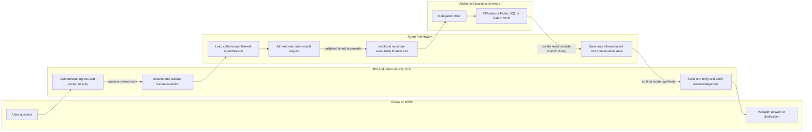

# Activity and finance execution flows

These flows apply to both language implementations. The native Activity host runs
inside Foundry and owns authentication, protocol handling, work dispatch and replies.
See [architecture](architecture-diagram.md) for service boundaries and
[operations](operations.md) for the acceptance record.

## Signed-in question

Reset and validated clarification continuation can complete without an outer
model call. The single-call limit applies to routing, not to the selected tool's
own embedding/reranking requests or the internal models of KPIpedia/Fabric.

## Sign-in continuation

1. Protected Activity ingress identifies the Bot/channel request. That identity
   does **not** authorize a person's finance data.
2. The host requests a user token through its named `mcs` OAuth connection.
   Silent token exchange may succeed; tenant policy can require interaction.
3. Until authentication completes, only process-owned OAuth continuation retains
   the pending turn. Tokens must not enter persisted finance state or logs.
4. On completion, the resumed turn validates the human assertion and matches its
   tenant/user to the Activity before reading state or executing a tool.
5. Each downstream client exchanges the validated assertion for its service's
   delegated token. No app-only financial-data fallback is permitted.

Bot routing identities are distinct from the approved finance OAuth client.
Both implementations require distinct Bot registrations and app packages; an
authorized OAuth client may be reused with validated resources/audiences.
Cached-token success is not evidence of a fresh silent SSO exchange.

## Statement and clarification

```mermaid
flowchart LR
    subgraph SResolve["Selected statement tool"]
        SInput["Raw KPI, scope and period terms"]
        SRelease["Read active release with delegated identity"]
        SCandidates["Exact matches or Search candidates"]
        SVisible["Revalidate authorized metadata visibility"]
        SPending["Save bounded clarification metadata"]
        SQuery["Execute fixed parameterized SQL"]
        SMath["Application decimal math and formatting"]
    end
    subgraph SActivity["Native Activity application"]
        SCard["Render clickable choices"]
        SChoice["Typed choice or card invoke"]
        SValidate["Validate caller, request, expiry and release"]
        SAck["Acknowledge invoke and queue fresh turn"]
        SResult["Deliver statement verbatim"]
    end
    SInput --> SRelease
    SRelease --> SCandidates
    SCandidates --> SVisible
    SVisible -->|"unambiguous authorized terms"| SQuery
    SVisible -->|"confirmation required"| SPending
    SPending --> SCard
    SCard --> SChoice
    SChoice --> SValidate
    SValidate --> SAck
    SAck -->|"reacquire user token and recheck scope"| SQuery
    SQuery --> SMath
    SMath --> SResult
```

Clickable rows contain application-issued option identifiers, not executable SQL.
Selections must match the caller, conversation, pending request and complete
catalogue release binding. Expired, changed, replayed or foreign selections fail
closed. Fuzzy/semantic candidates require confirmation, even if the first
retrieval result appears plausible.

Supported card invokes acknowledge promptly rather than waiting for finance.
The queued turn is a fresh normal-delivery message, not the completed invoke's
HTTP response. It reacquires authorization; user assertions are not queue payloads.
The implementation-specific host tests cover acknowledgement and dispatch ordering.

## Failure and persistence boundaries

| Event | Required behavior |
| --- | --- |
| Invalid ingress or human assertion | Reject before finance/session access |
| Multiple or invalid model tool calls | Reject; no selected tool executes |
| Missing or unauthorized catalogue scope | Clarify or deny; never broaden access |
| Dependency timeout | Bounded, safe user-facing failure; no invented result |
| Missing answer-delivery acknowledgement | Treat as delivery failure, not accepted final delivery |
| Process restart during work or sign-in | In-flight work/continuation may be lost; user retries |
| Process restart between completed turns | Filtered persisted finance memory can be loaded again |
| `reset` | Clear finance conversation state only; does not sign out or switch deployed version |

Neither Foundry conversation persistence nor the planned Cosmos adapter supplies
durable task replay. Delivery is not an exactly-once contract. A healthy readiness
endpoint also does not prove downstream permissions, silent SSO or visible chat delivery.
